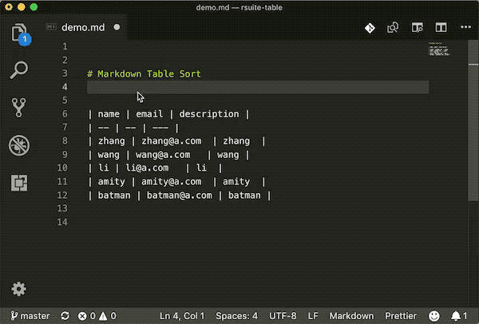

# [Markdown Table Sort](https://marketplace.visualstudio.com/items?itemName=simonguo.vscode-markdown-table-sort)


Markdown table prettier extension for Visual Studio Code.

## Features

- Support for formatting tables in documents.
- Support table sorting, according to the first column of content.



Eg.

```
| name   | email        | description |
| ------ | ------------ | ----------- |
| amity  | amity@a.com  | amity       |
| batman | batman@a.com | batman      |
| li     | li@a.com     | li          |
| wang   | wang@a.com   | wang        |
| zhang  | zhang@a.com  | zhang       |
```

Formated：

```
| name   | email        | description |
| ------ | ------------ | ----------- |
| amity  | amity@a.com  | amity       |
| batman | batman@a.com | batman      |
| li     | li@a.com     | li          |
| wang   | wang@a.com   | wang        |
| zhang  | zhang@a.com  | zhang       |
```

## Configuration

Edit your user or workspace settings to configure the extension.  

```json
// settings.json
{
  "markdownTableSortPrettier.enable": true,
  "markdownTableSortPrettier.sortOrder": "asc",
  "markdownTableSortPrettier.sortColumn": 0,
  "markdownTableSortPrettier.ignoreCharacters": ["~", " "]
}
```

- `markdownTableSortPrettier.enable` - Enable/disable markdown table sort. (default: `true`)
- `markdownTableSortPrettier.sortOrder` - Sort order, `asc` or `desc`. (default: `asc`)
- `markdownTableSortPrettier.sortColumn` - Sort column, `0` or `1` or `2`... (default: `0`)
- `markdownTableSortPrettier.ignoreCharacters` - Ignore characters. (default: `['~',' ']`)

## Referenced

- https://github.com/prettier/prettier
- https://github.com/TomasHubelbauer/vscode-markdown-table-format
